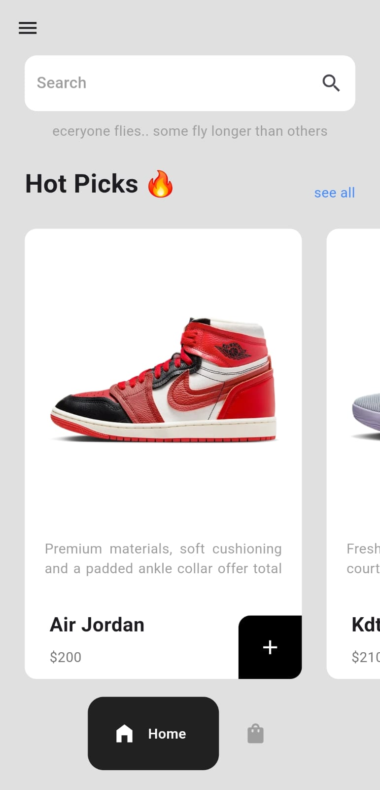
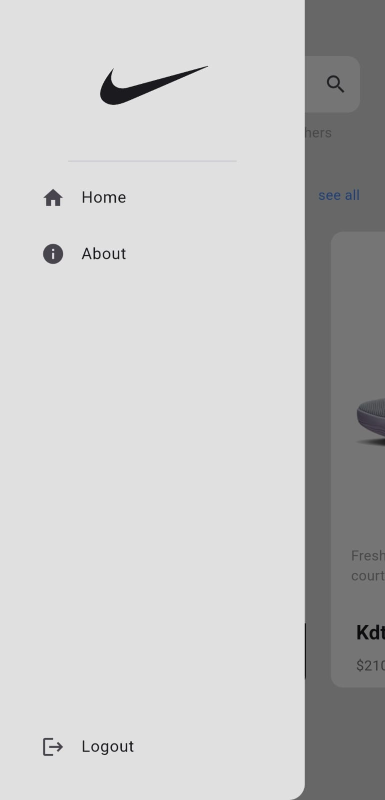
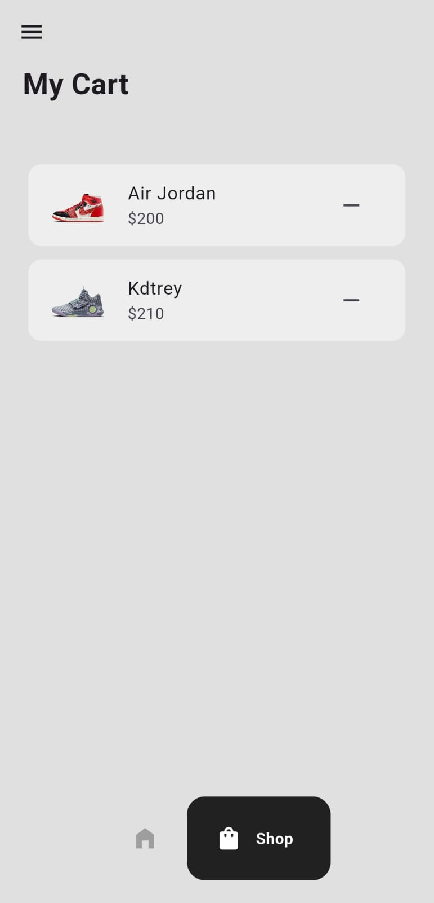

# Sneaker Shop Flutter App

Welcome to the Sneaker Shop Flutter App! This app is designed to provide users with a seamless shopping experience for sneakers, featuring a wide range of products and a smooth interface.

## Table of Contents

- [Features](#features)
- [Installation](#installation)
- [Usage](#usage)
- [Screenshots](#screenshots)
- [Dependencies](#dependencies)
- [Contributing](#contributing)
- [License](#license)

## Features

- **Home Page**: Displays the introductory page with branding and a call to action to start shopping.
- **Shop Page**: Allows users to browse through a list of available sneakers, search for products, and add items to their cart.
- **Cart Page**: Users can view items added to their cart and proceed to checkout.
- **Drawer Navigation**: Provides easy access to Home and About pages.
- **Bottom Navigation Bar**: Smooth navigation between Home and Cart pages.
- **Animations**: Page transitions and button interactions.

## Installation

1. **Clone the repository**:

   ```bash
   git clone https://github.com/Ziraddin/sneaker_shop.git
   cd sneaker_shop
   ```

2. **Install dependencies**:

   ```bash
   flutter pub get
   ```

3. **Run the app**:
   ```bash
   flutter run
   ```

## Usage

- **Home Page**:
  - Start by tapping on the "Shop now" button to explore the products.
- **Shop Page**:
  - Use the search bar at the top to find specific products.
  - Browse through the "Hot Picks" section to see featured items.
  - Tap on the "+" button to add items to your cart. A dialog will confirm the addition.
- **Cart Page**:

  - View the items added to your cart.
  - Remove items from the cart by tapping on the "remove" icon.

- **Drawer Navigation**:
  - Access the Home page and the About section through the side drawer.

## Screenshots






## Dependencies

- [flutter](https://flutter.dev)
- [provider](https://pub.dev/packages/provider)
- [page_transition](https://pub.dev/packages/page_transition)
- [google_nav_bar](https://pub.dev/packages/google_nav_bar)
